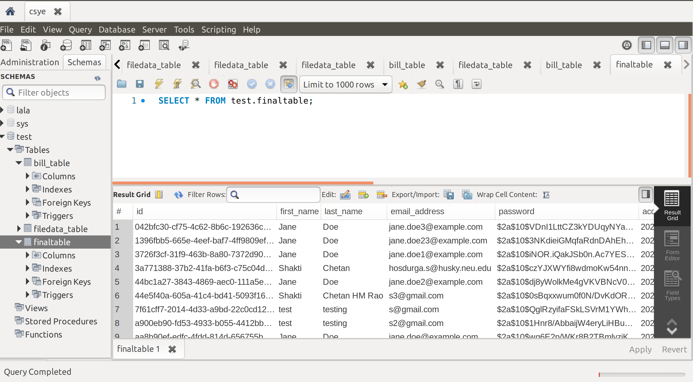
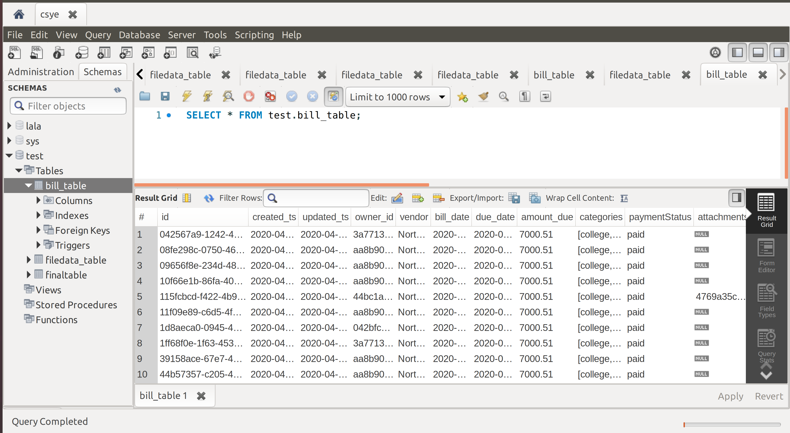
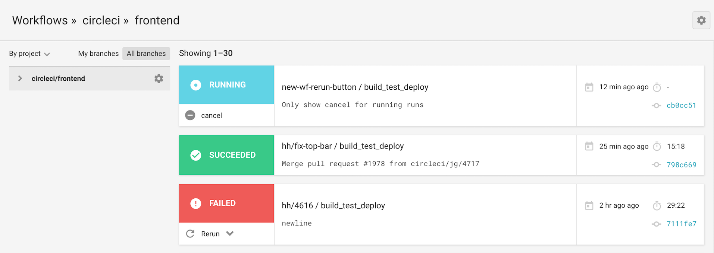
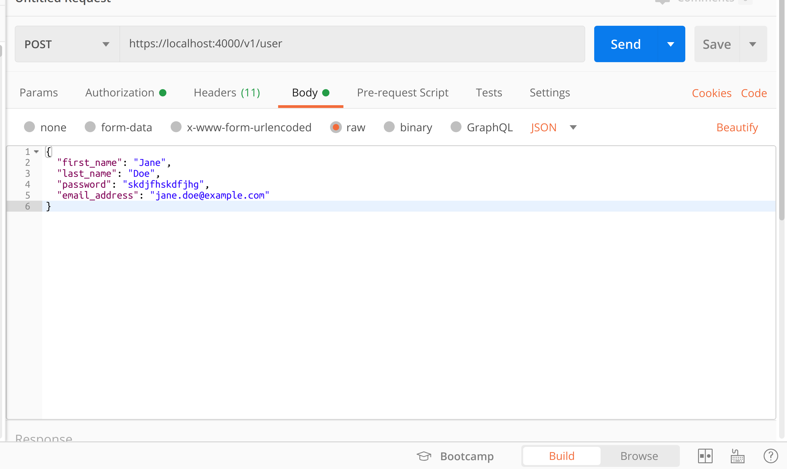
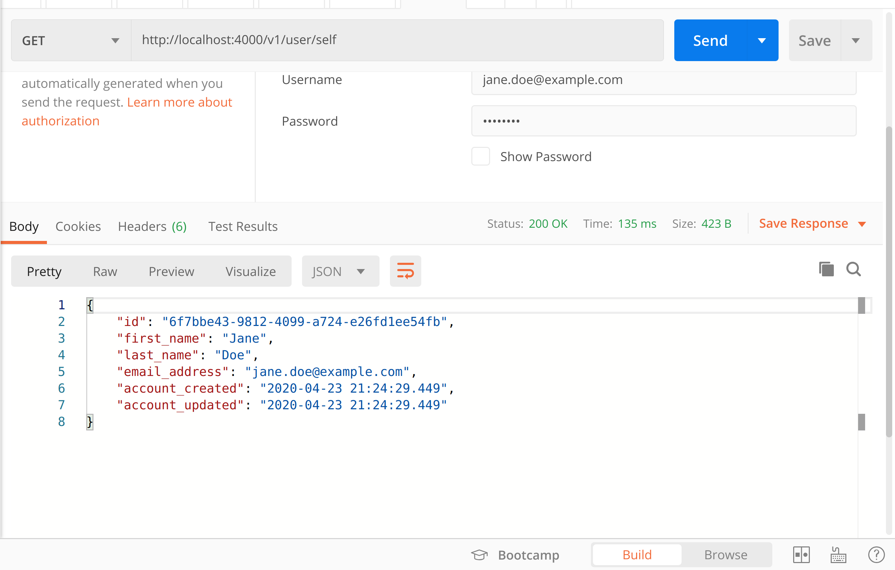
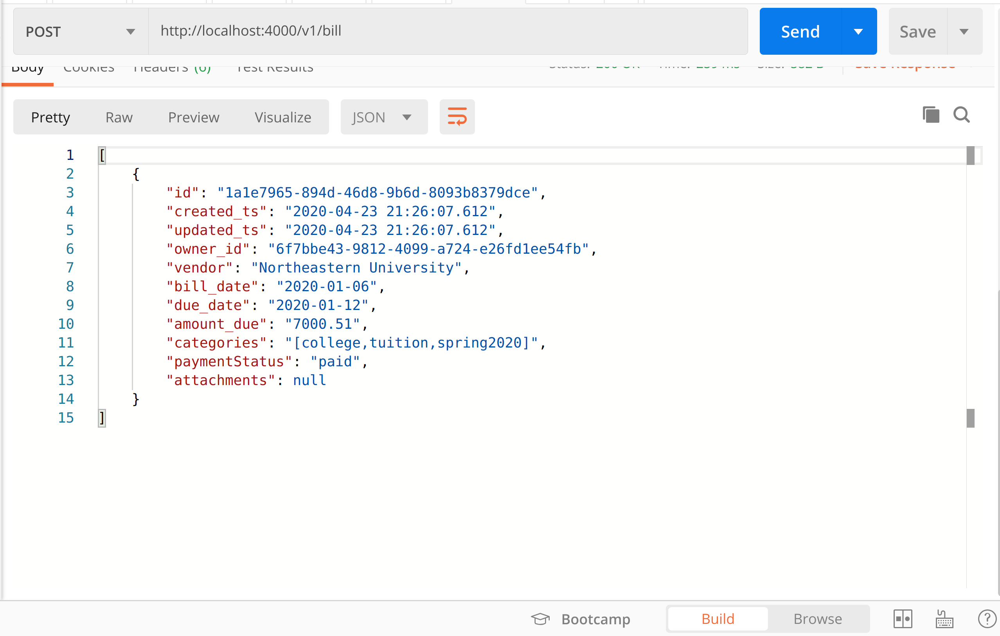
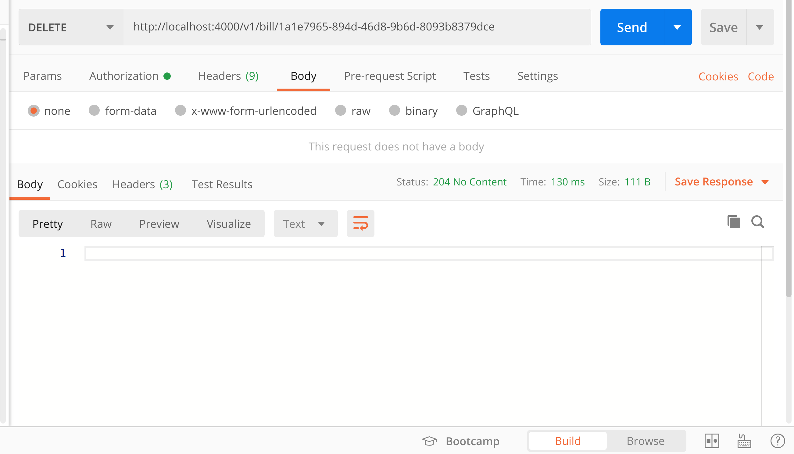

<div style="text-align: right">INFO 6210 Data Management and Database Design </div>
<div style="text-align: right"> Suman Rawat : NUID 001058600</div>
<div style="text-align: right"> Shakti Chetan : NUID 001375816</div>

# PROJECT: CUSTOMER BILL TRACKER USING AWS

## AIM 
The goal of this project was to track bills of every user and notify them when a bill's due date is approaching, using various features of AWS like EC2, Autoscaling, Load Balacing and Serverless functions.

# Content

* Technology Stack
* Introduction
    1. AWS
    2. RESTfulAPI
	3. AWS RDS
	4. Networking Fundamentals
	5. Infrastructure as Code
* API Endpoints
* Creating Bills
* Updating Bills
* Bill Database
* S3 Bucket
* Elastic Computing
* Autoscaling
* Load Balancing
* Continuous Integration
	1.Circle CI
* Results
* Create User
* Check User
* Create Bill
* Delete Bill 

## TECHNOLOGY STACK
* Backend: Node.js <br>
* Database: MySQL (AWS RDS INSTANCE) <br>
* Cloud Provider: AWS<br>
* Domain Name Provider: NameCheap<br>
* Continous Integration: Circle Ci<br>
* Continuous Deployment: CodeDeploy<br>

# INTRODUCTION

### 1. AWS
Amazon Web Services (AWS) is a subsidiary of Amazon that provides on-demand cloud computing platforms and APIs to individuals, companies, and governments, on a metered pay-as-you-go basis. In aggregate, these cloud computing web services provide a set of primitive abstract technical infrastructure and distributed computing building blocks and tools. One of these services is Amazon Elastic Compute Cloud, which allows users to have at their disposal a virtual cluster of computers, available all the time, through the Internet. AWS's version of virtual computers emulate most of the attributes of a real computer, including hardware central processing units (CPUs) and graphics processing units (GPUs) for processing; local/RAM memory; hard-disk/SSD storage; a choice of operating systems; networking; and pre-loaded application software such as web servers, databases, and customer relationship management (CRM)

### 2. RESTful API
Representational state transfer (REST) is a software architectural style that defines a set of constraints to be used for creating Web services. Web services that conform to the REST architectural style, called RESTful Web services, provide interoperability between computer systems on the Internet. RESTful Web services allow the requesting systems to access and manipulate textual representations of Web resources by using a uniform and predefined set of stateless operations. Other kinds of Web services, such as SOAP Web services, expose their own arbitrary sets of operations.

Representational state transfer (REST) is a software architectural style that defines a set of constraints to be used for creating Web services. Web services that conform to the REST architectural style, called RESTful Web services, provide interoperability between computer systems on the Internet. RESTful Web services allow the requesting systems to access and manipulate textual representations of Web resources by using a uniform and predefined set of stateless operations. Other kinds of Web services, such as SOAP Web services, expose their own arbitrary sets of operations.


### 3. AWS RDS
Amazon Relational Database Service (Amazon RDS) makes it easy to set up, operate, and scale a relational database in the cloud. It provides cost-efficient and resizable capacity while automating time-consuming administration tasks such as hardware provisioning, database setup, patching and backups. It frees you to focus on your applications so you can give them the fast performance, high availability, security and compatibility they need.

Amazon RDS is available on several database instance types - optimized for memory, performance or I/O - and provides you with six familiar database engines to choose from, including Amazon Aurora, PostgreSQL, MySQL, MariaDB, Oracle Database, and SQL Server. You can use the AWS Database Migration Service to easily migrate or replicate your existing databases to Amazon RDS.

```
Connect to AWS RDS
mysql -h mysql–instance1.123456789012.us-east-1.rds.amazonaws.com -P 3306 -u mymasteruser -p
```


### 4. NETWORKING FUNDAMENTALS


### 5. INFRASTRUCTURE AS CODE
Infrastructure as code (IaC) is the process of managing and provisioning computer data centers through machine-readable definition files, rather than physical hardware configuration or interactive configuration tools.The IT infrastructure managed by this comprises both physical equipment such as bare-metal servers as well as virtual machines and associated configuration resources. The definitions may be in a version control system. It can use either scripts or declarative definitions, rather than manual processes, but the term is more often used to promote declarative approaches.

#### AWS CLOUDFORMATION
AWS CloudFormation provides a common language for you to model and provision AWS and third party application resources in your cloud environment. AWS CloudFormation allows you to use programming languages or a simple text file to model and provision, in an automated and secure manner, all the resources needed for your applications across all regions and accounts. This gives you a single source of truth for your AWS and third party resources.


# Assessment


```python
value = input("1. AWS Stands For ?\n")
if value.lower() == 'amazon web services':
    print("Correct Answer : Amazon Web Services")
else:
    print("Incorrect : Correct Answer is Amazon Web Services")
```


```python
v2 = input("2. What is the central application in the AWS portfolio.\n")
if v2.lower() == 'amazon elastic compute cloud':
    print("Correct Answer : Amazon Elastic Compute Cloud")
else:
    print("Incorrect : Correct Answer is Amazon Elastic Compute Cloud")
```


```python
v3 = input("3. S3 Stands for Simple Storage Service\n True \n False \n")
if v3.lower() == 'true':
    print("Correct Answer : True")
else:
    print("Incorrect : Correct Answer is True")
```


```python
v4 = input("4. Q: Which relational database engines does Amazon RDS support?\n Aurora \n MySQL \n MariaDB \n All of the Above (A) \n")
if v4.lower() == 'a':
    print("Correct Answer : All of The Above")
else:
    print("Incorrect : Correct Answer is All of The Above")
```

# API ENPOINTS

### 1. POST /user
Creates a user with email, password, firstname and lastname.

```
{
id	string($uuid)
example: d290f1ee-6c54-4b01-90e6-d701748f0851
readOnly: true
first_name*	string
example: Jane
last_name*	string
example: Doe
password*	string($password)
example: skdjfhskdfjhg
writeOnly: true
email_address*	string($email)
example: jane.doe@example.com
account_created	string($date-time)
example: 2016-08-29T09:12:33.001Z
readOnly: true
account_updated	string($date-time)
example: 2016-08-29T09:12:33.001Z
readOnly: true
}
```


## 2. GET user/self 
This gives the details of the user. This is an authenticated endpoint. Only a valid user, with a username and password can log in and check his details.
The schema of this endpoint is as follows

```
{
  "id": "d290f1ee-6c54-4b01-90e6-d701748f0851",
  "first_name": "Jane",
  "last_name": "Doe",
  "email_address": "jane.doe@example.com",
  "account_created": "2016-08-29T09:12:33.001Z",
  "account_updated": "2016-08-29T09:12:33.001Z"
}
```

## 3. PUT user/self
This is to update or modify the atributes of the user.
The schema is

```
{
  "first_name": "Jane",
  "last_name": "Doe",
  "password": "skdjfhskdfjhg",
  "email_address": "jane.doe@example.com"
}
```




```python
post get put
```


```python
v5 = input("Q1: The POST operation adds an object to a specified bucket using HTML forms \n True \n False \n")
if v5.lower() == 'true':
    print("Correct Answer : True")
else:
    print("Incorrect : Correct Answer is True")
```


```python
v6 = input("Q2: To use GET, you do not need READ access to the object\n True \n False \n")
if v6.lower() == 'false':
    print("Correct Answer : false")
else:
    print("Incorrect : Correct Answer is False")
```


```python
v7 = input("Q3: Adds an object to a bucket. You must have ______ permissions on a bucket to add an object to it.\n \n")
if v7.lower() == 'write':
    print("Correct Answer : Write")
else:
    print("Incorrect : Correct Answer is Write")
```

## Creating Bills
The users cant hit ``` POST /bill``` to create a bill with the following attributes

```
{
id*	string($uuid)
example: d290f1ee-6c54-4b01-90e6-d701748f0851
readOnly: true
created_ts	string($date-time)
example: 2016-08-29T09:12:33.001Z
readOnly: true
updated_ts	string($date-time)
example: 2016-08-29T09:12:33.001Z
readOnly: true
owner_id*	string($uuid)
example: a460a1ef-6d54-4b01-90e6-d7017sad851
readOnly: true
vendor*	string
example: Northeastern University
bill_date*	string($date)
example: 2020-01-06
due_date*	string($date)
example: 2020-01-12
amount_due*	number($double)
example: 7000.51
minimum: 0.01
categories*	[...]
paymentStatus*	string
Enum:
Array [ 4 ]
attachment	File{...}
}
```

A bill would look something like this:
```
{
  "vendor": "Northeastern University",
  "bill_date": "2020-01-06",
  "due_date": "2020-01-12",
  "amount_due": 7000.51,
  "categories": [
    "college",
    "tuition",
    "spring2020"
  ],
  "paymentStatus": "paid",
  "attachment": {}
}
```

## Updating Bills
The users once they are logged in can use use the endpoint ```PUT bill/{billid} ``` to update the details of the bill


### The Bill Database


# S3 Bucket
Amazon S3 or Amazon Simple Storage Service is a service offered by Amazon Web Services (AWS) that provides object storage through a web service interface. Amazon S3 uses the same scalable storage infrastructure that Amazon.com uses to run its global e-commerce network.Amazon S3 can be employed to store any type of object which allows for uses like storage for Internet applications, backup and recovery, disaster recovery, data archives, data lakes for analytics, and hybrid cloud storage. AWS launched Amazon S3 in the United States on March 14, 2006, then in Europe in November 2007.


The images of the bills will be stored in the s3 bucket

# Elastic Computing
In cloud computing, elasticity is defined as "the degree to which a system is able to adapt to workload changes by provisioning and de-provisioning resources in an autonomic manner, such that at each point in time the available resources match the current demand as closely as possible". Elasticity is a defining characteristic that differentiates cloud computing from previously proposed computing paradigms, such as grid computing. The dynamic adaptation of capacity, e.g., by altering the use of computing resources, to meet a varying workload is called "elastic computing.

Let us illustrate elasticity through a simple example of a service provider who wants to run a website on an IaaS cloud. At moment , the website is unpopular and a single machine (most commonly a virtual machine) is sufficient to serve all web users. At moment , the website suddenly becomes popular, for example, as a result of a flash crowd, and a single machine is no longer sufficient to serve all users. Based on the number of web users simultaneously accessing the website and the resource requirements of the web server, it might be that ten machines are needed. An elastic system should immediately detect this condition and provision nine additional machines from the cloud, so as to serve all web users responsively.

At time , the website becomes unpopular again. The ten machines that are currently allocated to the website are mostly idle and a single machine would be sufficient to serve the few users who are accessing the website. An elastic system should immediately detect this condition and deprovision nine machines and release them to the cloud.


```python
v9 = input("Q1: Amazon Elastic Compute Cloud (Amazon EC2) is a web service that provides ________ compute capacity in the cloud. \n resizable \n constant \n")
if v9.lower() == 'resizable':
    print("Correct Answer : resizable")
else:
    print("Incorrect : Correct Answer is resizable")
```


```python
v10 = input("Q2: Is Amazon EC2 used in conjunction with Amazon S3? \n Yes \n No \n")
if v10.lower() == 'yes':
    print("Correct Answer : Yes")
else:
    print("Incorrect : Correct Answer is Yes")
```

## AUTOSCALING
AWS Auto Scaling monitors your applications and automatically adjusts capacity to maintain steady, predictable performance at the lowest possible cost. Using AWS Auto Scaling, it’s easy to setup application scaling for multiple resources across multiple services in minutes. The service provides a simple, powerful user interface that lets you build scaling plans for resources including Amazon EC2 instances and Spot Fleets, Amazon ECS tasks, Amazon DynamoDB tables and indexes, and Amazon Aurora Replicas. AWS Auto Scaling makes scaling simple with recommendations that allow you to optimize performance, costs, or balance between them. If you’re already using Amazon EC2 Auto Scaling to dynamically scale your Amazon EC2 instances, you can now combine it with AWS Auto Scaling to scale additional resources for other AWS services. With AWS Auto Scaling, your applications always have the right resources at the right time.

It’s easy to get started with AWS Auto Scaling using the AWS Management Console, Command Line Interface (CLI), or SDK. AWS Auto Scaling is available at no additional charge. You pay only for the AWS resources needed to run your applications and Amazon CloudWatch monitoring fees.


## LOAD BALANCING

A load balancer is a device that acts as a reverse proxy and distributes network or application traffic across a number of servers. Load balancers are used to increase capacity (concurrent users) and reliability of applications. They improve the overall performance of applications by decreasing the burden on servers associated with managing and maintaining application and network sessions, as well as by performing application-specific tasks.

Load balancers are generally grouped into two categories: Layer 4 and Layer 7. Layer 4 load balancers act upon data found in network and transport layer protocols (IP, TCP, FTP, UDP). Layer 7 load balancers distribute requests based upon data found in application layer protocols such as HTTP.

Requests are received by both types of load balancers and they are distributed to a particular server based on a configured algorithm. Some industry standard algorithms are:

* Round robin
* Weighted round robin
* Least connections
* Least response time


```python
v11 = input("Q1: Is there an SLA for load balancers? \n Yes \n No \n")
if v11.lower() == 'yes':
    print("Correct Answer : Yes")
else:
    print("Incorrect : Correct Answer is Yes")
```


```python
v12 = input("Q3: Which protocols does an Application Load Balancer support? \n \n")
if v12.lower() == 'http and https':
    print("Correct Answer : http and https")
else:
    print("Incorrect : Correct Answer is http and https")
```

## CONTINUOUS INTEGRATION
Continuous Integration (CI) is a development practice where developers integrate code into a shared repository frequently, preferably several times a day. Each integration can then be verified by an automated build and automated tests. While automated testing is not strictly part of CI it is typically implied.

One of the key benefits of integrating regularly is that you can detect errors quickly and locate them more easily. As each change introduced is typically small, pinpointing the specific change that introduced a defect can be done quickly.

In recent years CI has become a best practice for software development and is guided by a set of key principles. Among them are revision control, build automation and automated testing.

Additionally, Continuous Deployment and Continuous Delivery have developed as best-practices for keeping your application deployable at any point or even pushing your main codebase automatically into production whenever new changes are brought into it. This allows your team to move fast while keeping high quality standards that can be checked automatically.


### Circle CI
Put simply, CircleCI is built to help you test your app whenever you make changes, release or deploy it.

It consists of a simple YAML file where you tell it what to run whenever it detects a change to a Git branch.

To “get” CircleCI, you’ll need to understand the point of testing and linting your code. Basically, you won’t be able to manually check your codebase whenever you make a change, hence you need to automate things.

Anyway, once you have some sort of testing going in a codebase. You can have Circle run this whenever you make a change; and prevent deployment (for example) if things fail.




To trigger a Circle CI Job use 

```
curl -u ${CIRCLE_API_USER_TOKEN} \
     -d build_parameters[CIRCLE_JOB]=build \
     https://circleci.com/api/v1.1/project/<vcs-type>/<org>/<repo>/tree/<branch>
```

# RESULTS
We will be checking the response of the api endpoints using a Restful Client such as POSTMAN


## CREATE USER


## CHECK USER


## CREATE BILL


## DELETE BILL


# References
1. https://www.cloudways.com/blog/aws-for-beginners/#conclusion
2. https://aws.amazon.com/getting-started/
3. https://www.coursereport.com/blog/what-is-aws-a-guide-to-amazon-web-services-for-beginners
4. https://www.guru99.com/aws-tutorial.html
5. https://restfulapi.net/
6. https://www.smashingmagazine.com/2018/01/understanding-using-rest-api/
7. https://hackernoon.com/restful-api-design-step-by-step-guide-2f2c9f9fcdbf
8. https://www.slideshare.net/AmazonWebServices/aws-networking-fundamentals-145270167
9. https://www.guru99.com/mongodb-tutorials.html
10. https://beginnersbook.com/2017/09/mongodb-tutorial/
11. https://www.mongodb.com/

# License 
Copyright (c) 2020, Suman Rawat and Shakti Chetan
All rights reserved.

Permission is hereby granted, free of charge, to any person obtaining a copy of this software and associated documentation files (the "Software"), to deal in the Software without restriction, including without limitation the rights to use, copy, modify, merge, publish, distribute, sublicense, and/or sell copies of the Software, and to permit persons to whom the Software is furnished to do so, subject to the following conditions:

The above copyright notice and this permission notice shall be included in all copies or substantial portions of the Software.

THE SOFTWARE IS PROVIDED "AS IS", WITHOUT WARRANTY OF ANY KIND, EXPRESS OR IMPLIED, INCLUDING BUT NOT LIMITED TO THE WARRANTIES OF MERCHANTABILITY, FITNESS FOR A PARTICULAR PURPOSE AND NONINFRINGEMENT. IN NO EVENT SHALL THE AUTHORS OR COPYRIGHT HOLDERS BE LIABLE FOR ANY CLAIM, DAMAGES OR OTHER LIABILITY, WHETHER IN AN ACTION OF CONTRACT, TORT OR OTHERWISE, ARISING FROM, OUT OF OR IN CONNECTION WITH THE SOFTWARE OR THE USE OR OTHER DEALINGS IN THE SOFTWARE.

# Conclusion

AWS (Amazon Web Service) is a cloud computing platform that enables users to access on demand computing services like database storage, virtual cloud server, etc. This notebook will give an in-depth knowledge on AWS, RESTfulAPI, AWS RDS, Networking Fundamentals, Infrastructure as Code instance as well as useful strategy on how to build and modify instance for your own applications. This tutorial is prepared for beginners who want to learn how Amazon Web Services works to provide reliable, flexible, and cost-effective cloud computing services. Amazon’s AWS cloud computing service is secure and it is here to assist you in reducing your business data infrastructure costs. Therefore, opting for AWS cloud services will prove beneficial for your organization and will allow you to scale your business on a leading cloud infrastructure platform exponentially. Hopefully, you learned a great deal from our AWS tutorial for beginners. If you think we missed out anything worth sharing, do let us know in the comments section below.

# Contribution Statement

60% of the code is used from the websites and github mentioned in refernces cell. Rest of the 40% code is written by the authors using various python and database related references.


```python

```
